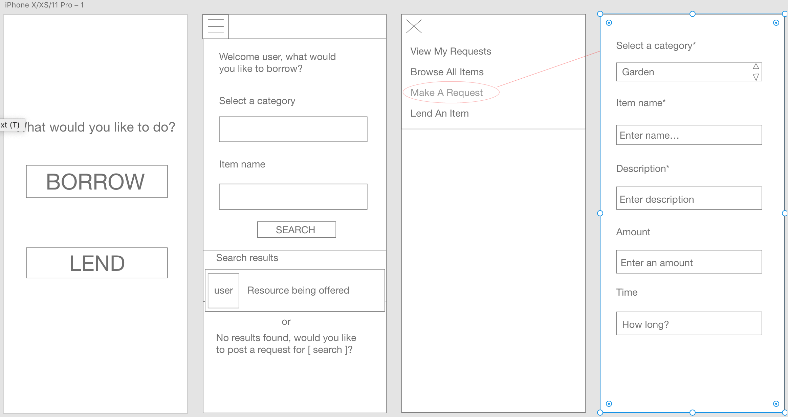

# Cup of Sugar (Front End)
## Contributors: Carla Geglio & Tristan Holtz

## Back End Repo: https://github.com/cup-of-sugar/cup-of-sugar-BE

## About
Cup of Sugar is an app that allows neighbors to communicate about items they have to lend or would like to borrow. Users can choose to login as a Lender or Borrower. As a Borrower, neighbors can post item requests for items they need or browse available items. As a Lender, neighbors can post items they have to lend or browse item requests in their neighborhood.

## Technologies Used
- React Native
- React Hooks
- React Navigation
- Apollo/GraphQL
- Jest

## Install
- Clone down repository
- Cd into project folder
- Run npm start
- To view with a desktop simulator on a Mac: download the xCode app from the Apple Store
- To view on your phone: download the Expo app and use the QR code from your terminal or browser

## Wireframe Design

## In Action

### Borrower View:

### Lender View:

